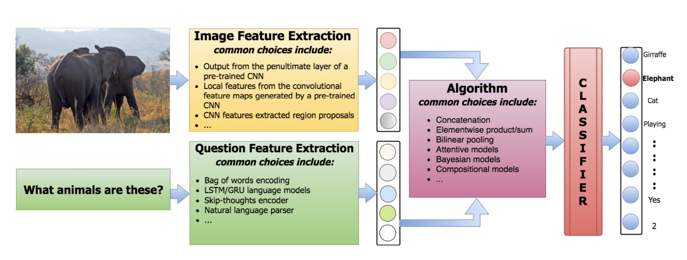

# Visual Question Answering

**参考资料：**[BDBC-KG-NLP/QA-Survey](https://github.com/BDBC-KG-NLP/QA-Survey)

**Awosome Repository:**

[jokieleung/awesome-visual-question-answering](https://github.com/jokieleung/awesome-visual-question-answering)

[CCYChongyanChen/VQA_AlgorithmDatasets](https://github.com/CCYChongyanChen/VQA_AlgorithmDatasets)

------

### 1、任务介绍

VQA（Visual Question Answering）指的是，**给机器一张图片和一个开放式的的自然语言问题，要求机器输出自然语言答案**。答案可以是以下任何形式：短语、单词、 (yes/no)、从几个可能的答案中选择正确答案。VQA是一个典型的多模态问题，融合了CV与NLP的技术，计算机需要同时学会理解图像和文字。为了回答某些复杂问题，计算机还需要了解常识，基于常识进行推理（common-sense resoning）。正因如此，直到相关技术取得突破式发展的2015年，VQA的概念才被正式提出。

### 2、常用数据集

#### 2.1 Visual Genome

官网地址：http://visualgenome.org

拓展阅读：[Visual Genome数据集梳理](https://zhuanlan.zhihu.com/p/102403048)

论文地址：[Visual genome: Connecting language and vision using crowdsourced dense image annotations. ICCV 2017.](https://arxiv.org/abs/1602.07332)

介绍：图像来源是YFCC100M和COCO数据集，包含图像108077张和1773258个QA Pairs（平均每张图片17个QA Pairs），问题类型是7W（what, where, how, when, who, why, which）。包含两种模式：

- **free-form method**：可以针对图像提出任意问题；人类标注者通常会趋向于提出类似的问题。
- regionspecific method：针对图像的指定区域提问；
  - Free form QA: What does the sky look like?
  - Region based QA: What color is the horse?

该数据集答案非常多样化，并且没有是否问题。

在Visual Genome中出现频率最高的1000个答案只覆盖了数据集中所有答案的65%，而对于CoCo-VQA，它们覆盖了82%，对于数据CoCo-VQA，它们覆盖了100%。Visual Genome的长尾分布也可以在答案的长度上观察到。只有57%的答案是单个单词，相比之下，COCO-VQA有88%的答案，COCO-QA有100%的答案，DAQUAR有90%的答案。答案的多样性使得开放式评估更具挑战性。

#### 2.2 Visual7W

介绍：是Visual Genome数据集的一个子集，7W 指的是 "What, Where, How, When, Who, Why, Which."。数据规模：有47300张图像和139868个QA pairs。包含两类问题，‘telling’问题和Visual Genome一样，答案是基于文本。‘pointing’类型是以“which”开头的问题，要求算法在可选的多个候选答案中，选择正确的边界框。数据集不包含是否问题。

下载地址：http://web.stanford.edu/~yukez/visual7w/

参考文献：Yuke Zhu, Oliver Groth, Michael Bernstein, and Li Fei-Fei. Visual7w: Grounded question answering in images. *In Proc. IEEE Conf. Comp. Vis. Patt. Recogn.*, 2016.

#### 2.3 VQAv1

VQA提出了一个open-ended answering task和一个multi-choice task。open-ended answering task的答案是完全开放的，而multi-choice task需要从一些可能的答案列表（每个问题十八个选项）中进行选择。

数据集图片：从MSCOCO数据集中收集了204721张图片，并且构建了一个新的抽象场景（卡通）数据集，包含了50000个场景。

组成：该数据集由两部分组成：COCO-VQA 和 SYNTH-VQA；前者为真实图像（来自COCO数据集的204,721张图像），后者为合成卡通图像（50,000张）。VQA Dataset 为为每幅图片提供了三个问题，每个问题有十个答案。

COCO-VQA ：该数据集比较大，共包含614,163 数据，其中，训练数据248,349个, 验证数据121,512,测试数据244,302 个。

SYNTH-VQA：由 50000 个合成场景组成，包含 100 多个不同的对象、30 种不同的动物模型和20个人类卡通模型。该数据集有15w问题对， 每个场景 3 个问题， 每个问题 10 个答案。通过使用合成图像，可以创建更多样化、更平衡的数据集。

SYNTH-VQA 和 COCO-VQA 包含open-ended 和multiple-choice（每个问题十八个选项）两种格式。VQAv1有很多语言偏见（bias），有些问题过于主观而无法得到正确的答案，有些问题通常不需要图像就能得到好的（或可能的）答案。还有些问题寻求解释或冗长的描述，而数据集提供的答案非常不可信。

下载地址：https://visualqa.org/vqa_v1_download.html

参考文献：S. Antol, A. Agrawal, J. Lu, M. Mitchell, D. Batra, C. L. Zitnick, and D. Parikh. VQA: Visual question answering. *In ICCV,* 2015.

#### 2.4 VQA v2

介绍：人工标注的开放式问答数据集，解决了VQA v1.0中语言偏见的问题（为每个问题补充了图片，为同一问题提供了不同答案的相似图像对），但是仍存在一些偏见。目前VQA自然数据集的基准一般是VQA v2（就是不用VQA v 1.0了）。

下载地址：https://visualqa.org/download.html

参考文献：Y. Goyal, T. Khot, D. Summers-Stay, D. Batra, and D. Parikh. Making the V in VQA matter: Elevating the role of image understanding in Visual Question Answering. *In CVPR*, 2017.

#### 2.5 GQA

一个用于对现实世界的图像进行视觉推理与综合回答的全新数据集 GQA，该数据集包含高达 20M 的各种日常生活图像，主要源自于 COCO 和 Flickr。每张图像都与图中的物体、属性与关系的场景图（scene graph）相关。此外，**每个问题都与其语义的结构化表示相关联，功能程序上指定必须采取一定的推理步骤才能进行回答。**

GQA 数据集的许多问题涉及多种推理技巧、空间理解以及多步推理，比起人们先前常用的视觉回答数据集，更具有挑战性。他们保证了数据集的平衡性，严格控制不同问题组的答案分布，以防止人们通过语言和世界先验知识进行有据猜测。

参考文献：Drew A Hudson and Christopher D Manning. Gqa: A new dataset for real-world visual reasoning and compositional question answering. Conference on Computer Vision and Pattern Recognition (CVPR), 2019.

### 3、模型

现有的视觉问答方法可以概括为如下三步：（1）将输入图像和输入问题，分别转换为对应的特征表示。（2）对两种模态的特征进行融合，得到图片和问题的联合信息。（3）最后把得到的联合特征送入到分类器中从预定义的候选答案集中推断最可能的答案，或者送入到解码循环神经网络中(Decoder RNN)来直接生成答案。

对于图像特征，大多数算法使用在ImageNet上经过预训练的CNN，常见示例为VGGNet，ResNet和GoogLeNet。问题特征化，包括词袋（BOW），长期短期记忆（LSTM）编码器，门控递归单元（GRU）等。

