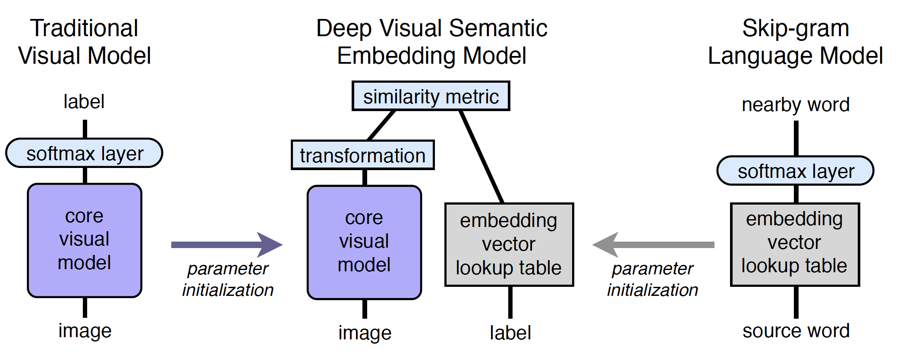
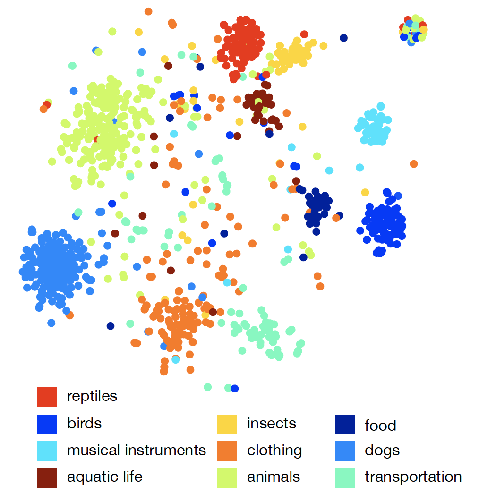

# DeViSE: A Deep Visual-Semantic Embedding Model

### 1、思路介绍

DeViSE的思路非常简单：原来的图像分类任务的标签是独立的，也就是one-hot标签。在标签比较少的时候，这样做看似没什么问题（比如只有犀牛、椅子、飞机三个标签，这三个东西确实没什么联系）。但是当标签种类增多的时候，比如增大到1000类甚至20000类的时候，**标签之间的语义相关性就不能忽视了**（比如说鸟下面都可以细分蜂鸟、喜鹊等等，他们肯定是类似的）。

因此，**DeViSE提出用word2vec训练得到的word embedding代替one-hot向量作为模型要预测的label，在此基础上进行fine-tune**。

这样的话，有两个明显的优点：

- 原有的模型（比如AlexNet）最后的线性层中神经元数量和分类类别一样，所以如果分类类别过多，参数也会太多。如果用embedding的话，参数就变成了embedding的dim。
- **在zero-shot learning会有显著的提升。**当模型见到一个没有见过的类别的图片时，它根据图片特征预测出来的embedding将在embedding space里面与相近的类别更加靠近。比如说训练图片中没有喜鹊，但是模型发现图片具有鸟类的一般特征，就会预测出和"喜鹊"相近的embedding（比如“蜂鸟”、“杜鹃“）。在top-k的选择中，有较大可能会包含"喜鹊"这个标签，因为word2vec得到的"喜鹊"的embedding在embedding space中和“蜂鸟”、“杜鹃“也是相近的。

> 使用one-hot label的model只会把图像预测为它们见过的模型标签，比如只会把"喜鹊"的图片预测为“蜂鸟”，但是不会预测出"喜鹊"这个新加入的label，因为它并不能理解"喜鹊"和“蜂鸟”的相似性。

### 2、模型介绍

如图所示，模型训练分为三部分：

#### 2.1 Language Model Pre-training

使用skip-gram作为语言模型，也就是上图最右边的Skip-gram Language Model。通过从wikipedia上抽取的含有5.7 million documents的数据集上进行训练，得到embedding。embedding的可视化结果如下图所示：

#### 2.2 Visual Model Pre-trainning

使用ILSVRC 2012 1K dataset（分类类别为1000类）的冠军模型AlexNet作为图像分类模型，也就是上图最左边的**core visual model**，在最后跟一个softmax layer转换为概率输出。

#### 2.3 Deep Visual-Semantic Embedding Model

分别使用上面两个模型初始化上图中间的两个部分，然后通过transformation将图像最后一层输出的长度为4096的feature变换为长度500或者1000（经过试验，这个长度时模型的效果最好）。最后，通过训练fine-tune模型参数。

可以看到，通过transform函数，图像的representation和label被映射到了同一space，这明显是coordinated representation。那么重点就是，如何衡量image和Label的相似性。

> Multimodal Machine Learning: A Survey and Taxonomy也重点举例了这个模型。

DeViSE是通过dot product来衡量相似性的。其定义的loss函数如下所示：
$$
\text { loss(image,label) }=\sum_{j \neq l a b e l} \max \left[0, \operatorname{margin}-\vec{t}_{\text {label }} M \vec{v}(\text { image })+\vec{t}_{j} M \vec{v}(\text { image })\right]
$$
可以看到，点积用于衡量image和label的相似性，整个Loss函数采用hinge rank loss的形式。$M$ 是transform layer训练得到的matrix，$\vec{t}_{\text {label }}$ 是和当前image的标签对应的embedding，$\vec{t}_{j}$ 是其他标签的embedding，$\vec{v}(\text { image })$ 是分类模型最后一层输出的vector。

rank score就是这一部分：
$$
\vec{t}_{\text {label }} M \vec{v}(\text { image })-\vec{t}_{j} M \vec{v}(\text { image })
$$
这种比较的方法在后面的研究中非常常用。即希望image和其对应label更匹配，dot product得到的值更高，和其他label不匹配，得到的点积值较小。因此希望这个差值越大越好。

而hinge loss是这一部分：
$$
\\max \left[0, \operatorname{margin}-(\vec{t}_{\text {label }} M \vec{v}(\text { image })-\vec{t}_{j} M \vec{v}(\text { image }))\right]
$$
hinge loss的意思是，rank score太高的结果是没有什么帮助的，应该多关注rank score较小，也就是差异较小的结果。因此设置了一个margin，如果rank score太好超过了这个margin，就不计入loss。

关于hinge loss推荐阅读：[Hinge loss](https://blog.csdn.net/hustqb/article/details/78347713)

### 3、训练及预测

使用预训练的模型初始化DeViSE的两部分后，首先固定这两部分的参数，只训练trandformation layer $M$ ；然后fine-tune图像分类模型。**注意，word2vec的部分参数始终是固定的**。

在测试时，当输入一个新图像后，首先通过图像分类器和transformation layer得到image vector，然后在embedding space中寻找相近的label即可。

