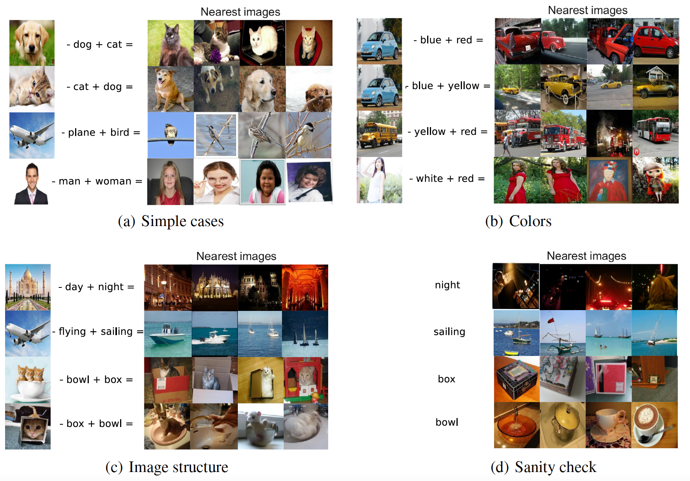
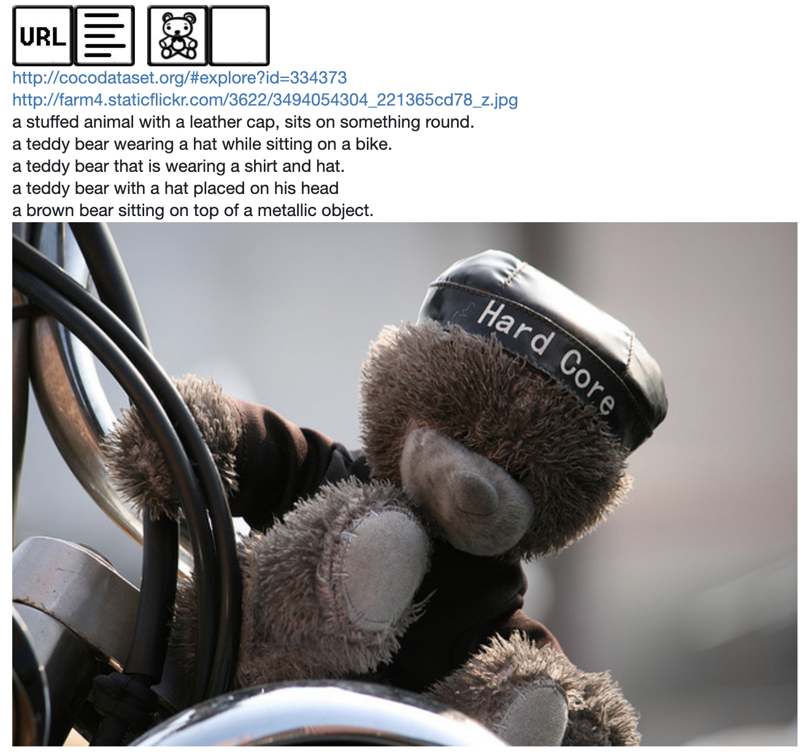
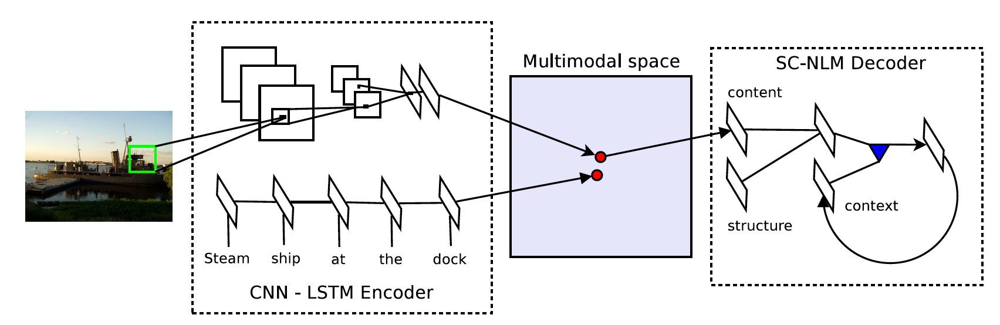
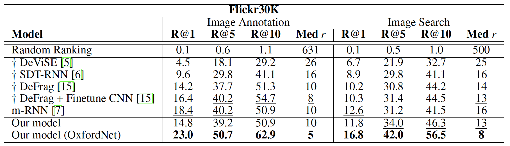

# Unifying Visual-Semantic Embeddings with Multimodal Neural Language Models

Accepted by NIPS 2014 deep learning workshop

参考博客：[图文互搜论文综述](https://zhuanlan.zhihu.com/p/25910749)

------

今天讲这一篇论文主要也是在CMU 11-777课程上，被这张图片的效果震撼到了。竟然可以根据图片和word做加减法做图片检索（兴奋）！不过，后面才发现原来这并没有使用这篇论文提出的结构，而是DeViSE改造来的。另外，它的效果也并不是那么好。但是，直观上确实是非常impressive，所以非常出名（个人感觉比这篇论文的主体模型出名很多）。可能，论文作者也没想到是这张图混出圈了吧（笑。

### 1、图文检索任务

#### 1.1 问题描述

图文检索任务可以分为

- 给定图片检索相似文本（Image Annotation）
- 给定文本检索相似图片（Image Search）

#### 1.2 数据集

论文中常用的数据集为 Flickr8k, Flickr30k, MSCOCO，它们分别包含8000, 31783, 333000张图片，每张图片有5个description。如[下图](https://cocodataset.org/#explore)所示。

#### 1.3 评测标准

- **Recall@K**：正确答案出现在前K个返回结果的样例占总样例的比例
- **Median r** ：使得 recall@K >= 50% 的最小 K 取值

因此，Recall@K越大越好，Median r越小越好。

具体示例参见：[图文互搜论文综述](https://zhuanlan.zhihu.com/p/25910749)

### 2、模型

这篇论文提出了一个Encoder-Decoder结构，其中：

- Encoder将image和description映射到在同一个joint space，可以做图文检索任务。
- Decoder可以对图像表示进行解码，可以做image caption任务。

我们这次主要感兴趣的是Encoder部分，因此只讲解前者。SC-NLM结构现在不是很常用了，我们略过不表。

#### 1.1 sentence encode

每一句image description表示为 $S=\left\{w_1,...,w_N\right\}$ ，其中 $w_1,...,w_N$ 是各个word的 representation。$w_1,...,w_N$ 要先过一个embedding Layer得到word embedding，然后将整个句子输入LSTM，取最后一个时间步（time step N）的output $\mathbf{v}$ 作为整个句子的representation。

#### 1.2 image encode

采用ILSVRC 2014图像识别竞赛的亚军模型 [OxfordNet](https://arxiv.org/abs/1409.1556) 抽取长度为4096的image feature，记为 $\mathbf{q}$ 。过一个不带权重的线性层，得到image embedding $\mathbf{x}$ :
$$
\mathbf{x}=\mathbf{W_I}\cdot \mathbf{q}
$$

#### 1.3 loss function

和上一篇DeViSE一样，本文也使用归一化然后点积度量image embedding和sentence embedding之间的相似性。

> 之前也提到过，点积+归一化等于余弦相似度。

定义 scoring function：
$$
s(\mathbf{x},\mathbf{v})=\mathbf{x}\cdot \mathbf{v}
$$
其中，$\mathbf{x}$ 和 $\mathbf{v}$ 已经被归一化了。设 $\boldsymbol{\theta}$ 为需要学习的参数（ $\mathbf{W_I}$ 和LSTM的所有权重），则我们定义如下的pairwise ranking loss：
$$
\min _{\boldsymbol{\theta}} \sum_{\mathbf{x}} \sum_{k} \max \left\{0, \alpha-s(\mathbf{x}, \mathbf{v})+s\left(\mathbf{x}, \mathbf{v}_{k}\right)\right\}+\sum_{\mathbf{v}} \sum_{k} \max \left\{0, \alpha-s(\mathbf{v}, \mathbf{x})+s\left(\mathbf{v}, \mathbf{x}_{k}\right)\right\}
$$
和DeViSE一样是hinge rank loss的形式。其中，$\mathbf{v}_{k}$ 是和当前图像不匹配的description的表示，$\mathbf{x}_{k}$ 同理。可以看到，和DeViSE相比，这里的hinge rank loss变为了对称的形式：不仅考虑了image和不匹配的description，还考虑了description和不匹配的image的情况。这时的hinge rank loss才是比较完善的版本，后续的工作也大都采用这种形式。

> 关于hinge rank loss的解释详见上一篇文章。

### 3、实验结果

上图是各个模型在Flickr30K数据集上的表现。可以看到，和同时期的其他模型相比，本篇论文的模型在各指标上均有明显的提升。

在这里提一下，为什么DeViSE可以出现在这里，是因为sentence是使用word embedding的均值来表示的（捂脸）。DeViSE本来就是搞word embedding和image匹配的，因此在这里效果不好也很正常，不过还是比random ranking强很多，不得不说DeViSE是非常好的工作。

### 4、Multimodal linguistic regularities

这里就要说一下出圈的这张图是怎么来的了，也就是这张图：

首先，这张图所用的sentence embedding并不是通过LSTM得到的，而是将word embedding加和得到的：
$$
\mathbf{v} = \sum_{i=1}^N\mathbf{w}_i
$$
其中，$\mathbf{v}$ 是sentence vector，而 $\mathbf{w}_i$ 是通过embedding Layer得到的word embedding。模型在训练时采用和上文一致的loss函数。

因此，直观来看，令 $\mathbf{I}_{bcar}$ 是blue car的图片，那么它们的representation在joint space里面就会与"blue car"这一description的sentence embedding靠近，这是由loss function保证的。而"blue car"的sentence embedding又是"blue"和"car"的embedding的加和，即有：
$$
\mathbf{v}_{blue} + \mathbf{v}_{car} \approx \mathbf{I}_{bcar}
$$
同理，令 $\mathbf{I}_{rcar}$ 表示red car的图片，有：
$$
\mathbf{v}_{red} + \mathbf{v}_{car} \approx \mathbf{I}_{rcar}
$$
变换可得：
$$
\begin{aligned}
\mathbf{v}_{c a r} & \approx \mathbf{I}_{b c a r}-\mathbf{v}_{b l u e} \\
\mathbf{v}_{r e d}+\mathbf{v}_{c a r} & \approx \mathbf{I}_{b c a r}-\mathbf{v}_{b l u e}+\mathbf{v}_{r e d} \\
\mathbf{I}_{r c a r} & \approx \mathbf{I}_{b c a r}-\mathbf{v}_{b l u e}+\mathbf{v}_{r e d}
\end{aligned}
$$
这就是上图的实现原理了。

在具体操作中，给定query image $\mathbf{q}$ ，negative word $\mathbf{w}_{n}$ 和 positive word $\mathbf{w}_{p}$ （都已归一化），则图像检索等同于找到 image $\mathbf{x}^*$ 满足优化问题：
$$
\mathrm{x}^{*}=\underset{\mathbf{x}}{\operatorname{argmax}} \frac{\left(\mathbf{q}-\mathbf{w}_{n}+\mathbf{w}_{p}\right)^{\top} \mathbf{x}}{\left\|\mathbf{q}-\mathbf{w}_{n}+\mathbf{w}_{p}\right\|}
$$
其中，$\left\|\mathbf{q}-\mathbf{w}_{n}+\mathbf{w}_{p}\right\|$ 是为了保持 $\mathbf{x}^*$ 和 $\mathbf{x}$ 尺度一致。

在top-4（找到最相关的前四个图片）的检索结果中，偶尔会出现一些不匹配的图片。论文给出的简单的解决方案是：先找到top-N（大于4）个图片，然后根据这些图片据它们在joint space中中心点的距离排序，再选择前4个图片。这一方案对滤去不匹配图片有不错的效果。

### 5、总结

和上一篇文章的DeViSE相比，这篇文章给出了sentence维度的representation learning的解决方案，依然沿用了DeViSE的理念，且优于同时期的其他模型，取得了不错的效果。在coordinated representation领域是非常奠基式的工作了。在后面的工作中，hinge rank loss这种Loss function形式也是非常常用的。

同时，这篇文章非常impressive的出圈图的效果，再一次印证了DeViSE的强大：第四部分中所述的模型训练方式和第三部分实验结果中DeViSE的训练方式是几乎一致的，把均值改为加和没有什么影响。

