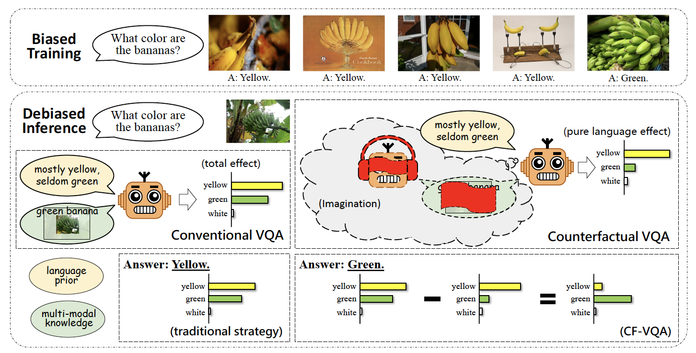
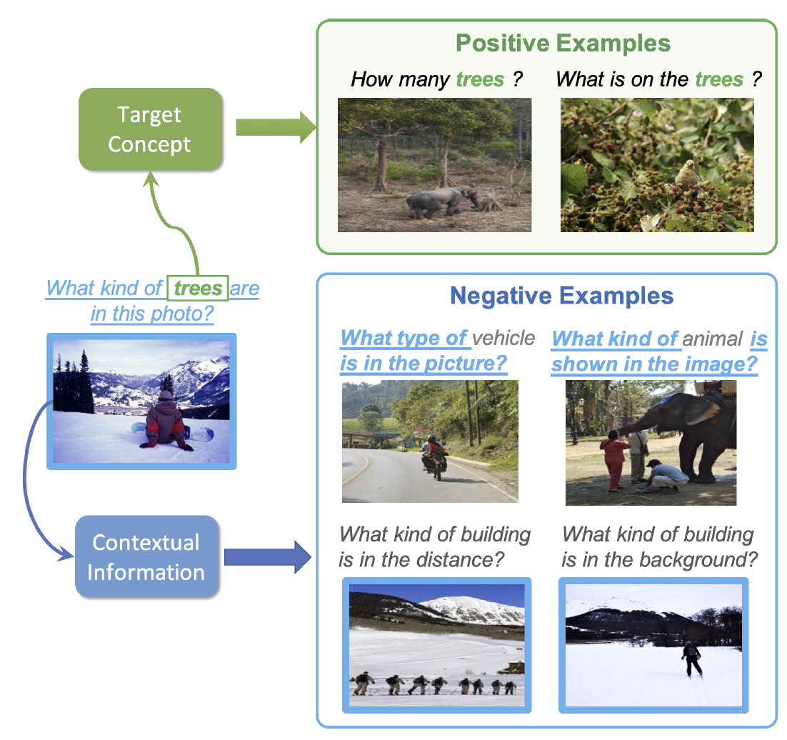

# Reading Notes

## VQA

解读和总结：[2021 CVPR | VQA论文速递](https://zhuanlan.zhihu.com/p/381638389)

### Counterfactual VQA: A Cause-Effect Look at Language Bias

[[讲解]](https://blog.csdn.net/MTandHJ/article/details/115539504) [[code]](https://github.com/yuleiniu/cfvqa)

之前的VQA v2的训练集分布是有bias的，比如40%的运动类问题的答案是"tennis"，90%的"Do you see a ..."类问题可以用"yes"来回答。之前的工作都是用数据扩充的方案添加样本，平衡训练集。本文认为，也可以通过另一种思路：即如何在含有bias的模型中把bias消除掉。通过减去Counterfactual VQA的结果，实现了这一点。

### Separating Skills and Concepts for Novel Visual Question Answering

通常情况，人类如果会回答“color”相关的问题，并能识别“car”，就能回答“what color is the car?”这样的问题。机器同理也应该有这种利用compositionality来泛化的能力。

本文所提出的模型有两个contrastive learning模块，分别去学习concept grounding和skill matching。

#### Concept grounding:

以下图为例，

positive samples要包含target concept"tree", 但是场景和问题要尽量与target image-question pairs不相似。

negative samples不包含target concept "tree", 但是场景和问题要尽量与target image-question pairs相似。

场景相似性是由以下公式衡量的：
$$
\xi=\beta \cos \left(q, q^{\prime}\right)+(1-\beta) \cos \left(v, v^{\prime}\right)
$$
其中，$q$ 和 $v$ 是target的question representation和image representation； $q^{\prime}$ 和 $v^{\prime}$ 选自candidate set。$\beta$​​ 是一个可供调节的标量。

#### Skill Matching

给定一个问题，比如“what color"，人类就能知道这个问题需要啥skill去回答，不需要知道具体的concept，所以作者在这里把concept都masked了，然后算出question的BERT representation, 与target question对比相似性，top-200相似的就是positive samples，剩下的就是negative samples。

#### My Review

idea乍一看很新颖，到后面的实验部分感觉只是在做zero-shot，而且做得很粗糙，实验数据集也是自己构造的，对比的模型也不太行。也是一个很初步的工作吧，以后有兴趣可以多看看。

