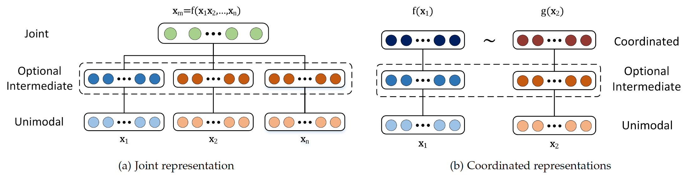
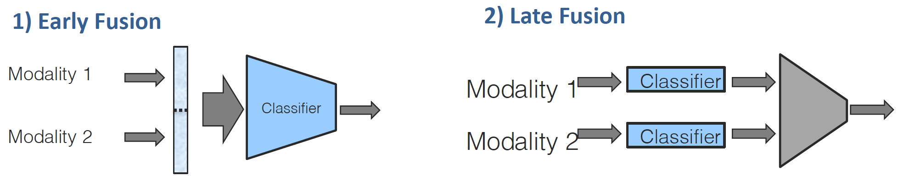
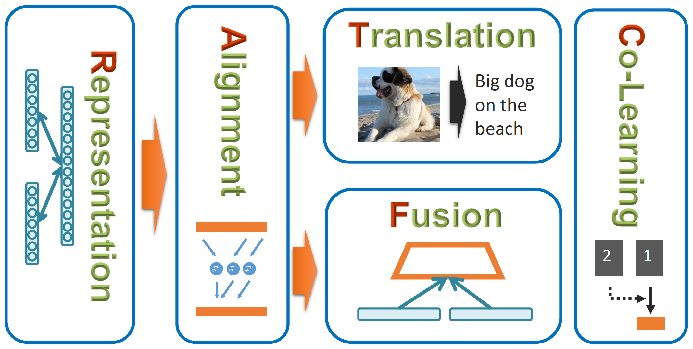

# Multimodal Machine Learning: A Survey and Taxonomy

### 多模态的五个分类

### 1、Representation

Representation 是学习如何统一地表示多模态数据，以利用模态之间的互补信息。比如最近大火的ViL-BERT。

#### 1.1 joint representation

联合表示将单模态的信号都结合到同一个表示空间中。联合表示在Fusion中还是很常见的，各种粗暴的concat。joint representation可以用下式表示：
$$
\mathbf{x}_{m}=f\left(\mathbf{x}_{1}, \ldots, \mathbf{x}_{n}\right)
$$
其中，$\left(\mathbf{x}_{1}, \ldots, \mathbf{x}_{n}\right)$ 是单模态的表示，通过 $f$ （神经网络模型）计算联合表示 $\mathbf{x}_{m}$ 。

由于深层神经网络的多层性，假设每一层后续的神经网络以更抽象的方式来表示数据，因此，通常使用最后一层或倒数第二层神经网络作为一种数据表示形式。

为了使用神经网络构建一个多模态表示，每个模态都从几个单独的神经层开始，然后是一个隐藏层，该层将模态投射到一个共同空间。

#### 1.2 coordinated representation

协同表示将独立地处理单模态的信号，但是通过相似度约束将它们统一在我们所定义协同空间中。不如说syntax那一篇就明显是这种方法。coordinated representation可以用下式表示：
$$
f\left(\mathbf{x}_{1}\right) \sim g\left(\mathbf{x}_{2}\right)
$$
可以看到，每一个模态都有一个projection function（$f$ 和 $g$ ）,将模态表示映射到联合空间中，然后，在联合空间中通过cos函数等衡量它们的相似度。主要要学习的就是两个projection function，他两比较重要，把两个模态表示映射到了同一个空间里面。

相似性度量可以**最小化协调空间中模态之间的距离**。 比如使得单词狗和狗的图像之间的距离比单词狗和汽车的图像之间的距离更小，比如说可以使用余弦距离等。

### 2、Translation

如何将一种模态的数据翻译为另一种模态的数据，比如image-caption。

### 3、Alignment

如何识别多种模态之间的元素之间的联系，并将它们对齐。比如attention机制可以将query映射到图像的某个位置。

### 4、Fusion

如何融合多模态的信息来进行预测，比如multimodal NER。

**多模态融合**是多峰机器学习中的原始主题之一，先前的调查都强调**早期融合early fusion，晚期融合 late fusion 和混合融合 hybrid fusion**方法。

用技术术语来说，**多模态融合指从多个模态信息中整合信息来完成分类或回归任务。**

**主要优点**：

- 在观察同一个现象时引入多个模态，可能带来**更好的预测**。
- 使用多种模态的信息，可能使我们能够捕获**互补 complementary 的信息**，这些信息在单模态中不可见。
- **缺少一种模态**时，多模态系统仍然可以运行。

**早期融合：**

- **基于特征。**通常是在各模态特征被抽取后就进行融合，通常只是简单地拼接特征。
- **它可以学习利用每种模态的底层特征之间的相关性和相互作用**。 只需要训练单个模型，与后期融合和混合融合相比训练上更为简单。
- 输出类型是分类问题，不适用时间建模，可用于情感分析。

**晚期融合：**

- **基于决策。**该方法在各个模态做出决策后才进行融合，得出最终的决策。常见的机制有平均 averaging、投票 voting、基于信道噪声的加权和信号方差等等。
- 每个模态使用不同的模型，从而具有更大的灵活性。
- 当缺少一个或多个模态时，更容易进行预测，甚至在没有并行数据可用时也可以进行训练。
- **缺点**：后期融合忽略了模态之间的底层特征之间的交互。

### 5、Co-learning

如何在模态间传递知识，比如用资源丰富的一种模态训练模型，然后运用到资源匮乏的模态上。

### 6、Relation

如下图所示，Representation和Alignment是最基础的，哪里都会遇到这两个概念。在此之下，有两个具体的方向，一个是Translation，即把一种模态翻译为另一种模态；另一个是Fusion通过模态之间的融合来结合增强representation信息。

