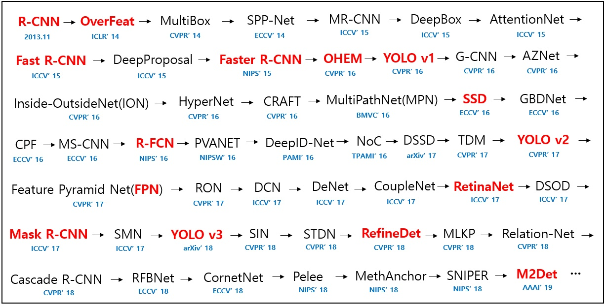

# 目标检测模型调研

参考博客：

[deep_learning_object_detection](https://github.com/hoya012/deep_learning_object_detection)

[基础目标检测算法介绍（一）：CNN、RCNN、Fast RCNN和Faster RCNN](https://zhuanlan.zhihu.com/p/46963225)

------

模型概览：

### 1、解决目标检测任务的CNN简单方法

下图是描述目标检测算法如何工作的典型例子，图中的每个物体（不论是任务还是风筝），都能以一定的精确度被定位出来。

首先我们要说的就是在图像目标检测中用途最广、最简单的深度学习方法——卷积神经网络（CNN）。向CNN中输入一张图片，接着将它传递到多个卷积和池化层中。最后输出目标所属的类别，听上去非常直接。对每张输入的图片，我们都有对应的输出类别，那么这一技术能检测图片中多种目标吗？答案是肯定的！下面就让我们看看如何用一个卷积神经网络解决通用的目标检测问题。

1.首先，我们把下面的图片用作输入：

2.之后，我们将图片分成多个区域：

3.将每个区域看作单独的图片。

4.把这些区域照片传递给CNN，将它们分到不同类别中。

5.当我们把每个区域都分到对应的类别后，再把它们结合在一起，完成对原始图像的目标检测：

使用这一方法的问题在于，图片中的物体可能有不同的长宽比和空间位置。例如，在有些情况下，目标物体可能占据了图片的大部分，或者非常小。目标物体的形状也可能不同。

有了这些考虑因素，我们就需要分割很多个区域，需要大量计算力。所以为了解决这一问题，减少区域的分割，我们可以使用基于区域的CNN，它可以进行区域选择。

### 2、基于区域的卷积神经网络介绍

#### 2.1 RCNN简介

主要贡献点：将CNN引入目标检测。

[RCNN-将CNN引入目标检测的开山之作](https://zhuanlan.zhihu.com/p/23006190)

RCNN算法分为4个步骤

1. 候选区域生成： 一张图像生成1K~2K个候选区域 （采用Selective Search方法）
2. 特征提取： 对每个候选区域，使用深度卷积网络提取特征 （CNN）
3. 类别判断： 特征送入每一类的SVM 分类器，判别是否属于该类
4. 位置精修： 使用回归器精细修正候选框位置

**关于selective search为什么最后能得到矩形框：**

[目标检测之选择性搜索-Selective Search](https://www.cnblogs.com/zyly/p/9259392.html)

- 区域的合适度距离

  如果区域$r_i$包含在$r_j$内，我们首先应该合并，另一方面，如果$r_i$很难与$r_j$相接，他们之间会形成断崖，不应该合并在一块。这里定义区域的合适度距离主要是为了衡量两个区域是否更加“吻合”，其指标是合并后的区域的Bounding Box（能够框住区域的最小矩形$BB_ij$）越小，其吻合度越高，即相似度越接近1。

#### 2.2 RCNN的问题

现在，我们了解了RCNN能如何帮助进行目标检测，但是这一技术有自己的局限性。训练一个RCNN模型非常昂贵，并且步骤较多：

- 根据selective search，要对每张图片提取2000个单独区域；
- 用CNN提取每个区域的特征。假设我们有N张图片，那么CNN特征就是N*2000；
- 用RCNN进行目标检测的整个过程有三个模型：
  - 用于特征提取的CNN
  - 用于目标物体辨别的线性SVM分类器
  - 调整边界框的回归模型。

这些过程合并在一起，会让RCNN的速度变慢，通常每个新图片需要40—50秒的时间进行预测，基本上无法处理大型数据集。所以，这里我们介绍另一种能突破这些限制的目标检测技术。

### 3、Fast RCNN

#### 3.1 Fast RCNN简介

主要贡献点：引入ROI pooling，将2000次独立计算变为1次。

[Fast R-CNN 模型原理/细节/冷知识](https://zhuanlan.zhihu.com/p/79054417)

想要减少RCNN算法的计算时间，可以用什么方法？**我们可不可以在每张图片上只使用一次CNN即可得到全部的重点关注区域呢，而不是运行2000次。**

RCNN的作者Ross Girshick提出了一种想法，在每张照片上只运行一次CNN，然后找到一种方法在2000个区域中进行计算。在Fast RCNN中，我们将图片输入到CNN中，会相应地生成传统特征映射。利用这些映射，就能提取出感兴趣区域。之后，我们使用一个Rol池化层将所有提出的区域重新修正到合适的尺寸，以输入到完全连接的网络中。

简单地说，这一过程含有以下步骤：

1. 输入图片。
2. 输入到卷积网络中，它生成感兴趣区域。
3. 利用Rol池化层对这些区域重新调整，将其输入到完全连接网络中。
4. 在网络的顶层用softmax层输出类别。同样使用一个线性回归层，输出相对应的边界框。

所以，和RCNN所需要的三个模型不同，Fast RCNN只用了一个模型就同时实现了区域的特征提取、分类、边界框生成。

#### 3.2 Fast RCNN的问题

但是即使这样，Fast RCNN也有某些局限性。**它同样用的是选择性搜索作为寻找感兴趣区域的，这一过程通常较慢。**与RCNN不同的是，Fast RCNN处理一张图片大约需要2秒。但是在大型真实数据集上，这种速度仍然不够理想。

### 3、Faster RCNN

#### 3.1 Faster RCNN简介

主要贡献点：引入Region Proposal网络，比selective search效果更好速度更快。

[一文读懂Faster RCNN](https://zhuanlan.zhihu.com/p/31426458)

Faster RCNN是Fast RCNN的优化版本，二者主要的不同在于感兴趣区域的生成方法，Fast RCNN使用的是选择性搜索，而Faster RCNN用的是Region Proposal网络（RPN）。RPN将图像特征映射作为输入，生成一系列object proposals，每个都带有相应的分数。

下面是Faster RCNN工作的大致过程：

1. 输入图像到卷积网络中，生成该图像的特征映射。
2. 在特征映射上应用Region Proposal Network，返回object proposals和相应分数。
3. 应用Rol池化层，将所有proposals修正到同样尺寸。
4. 最后，将proposals传递到完全连接层，生成目标物体的边界框。

#### 3.2 Faster RCNN的问题

目前为止，我们所讨论的所有目标检测算法都用区域来辨别目标物体。网络并非一次性浏览所有图像，而是关注图像的多个部分。这就会出现两个问题：

- 算法需要让图像经过多个步骤才能提取出所有目标
- 由于有多个步骤嵌套，系统的表现常常取决于前面步骤的表现水平

### 4、Mask RCNN

#### 4.1 Mask RCNN简介

主要贡献点：多了一个Mask分支，不仅可以做目标检测，还可以做实例分割。

[令人拍案称奇的Mask RCNN](https://zhuanlan.zhihu.com/p/37998710)

[Mask R-CNN](https://zhuanlan.zhihu.com/p/65321082)

Mask RCNN在 Faster RCNN 的基础上，延伸出了一个 **Mask** 分支。根据 Faster RCNN 计算出来的每个候选框的分数，筛选出一大堆更加准确的 RoI（对应图中 **selected RoI**），然后用一个 **RoI Align** 层提取这些 RoI 的特征，计算出一个 mask，根据 RoI 和原图的比例，将这个 mask 扩大回原图，就可以得到一个分割的 mask 了。
