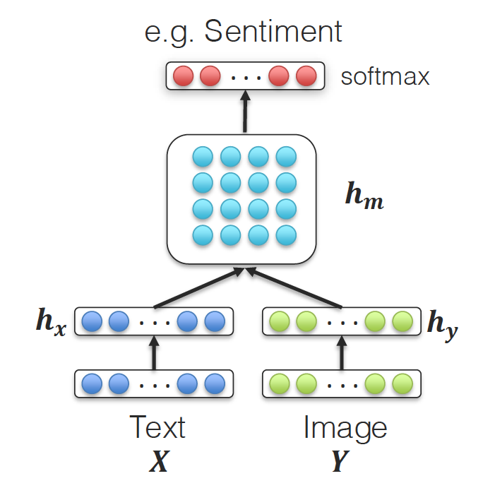
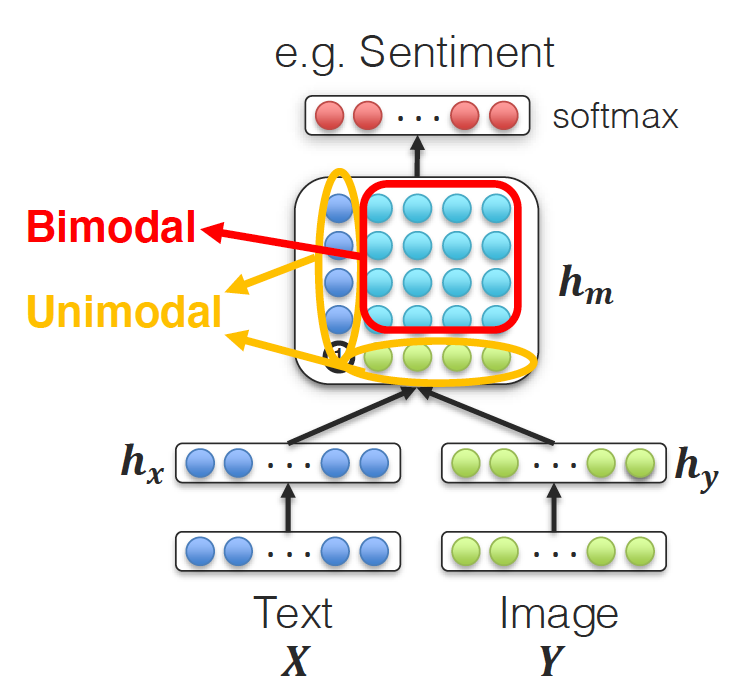
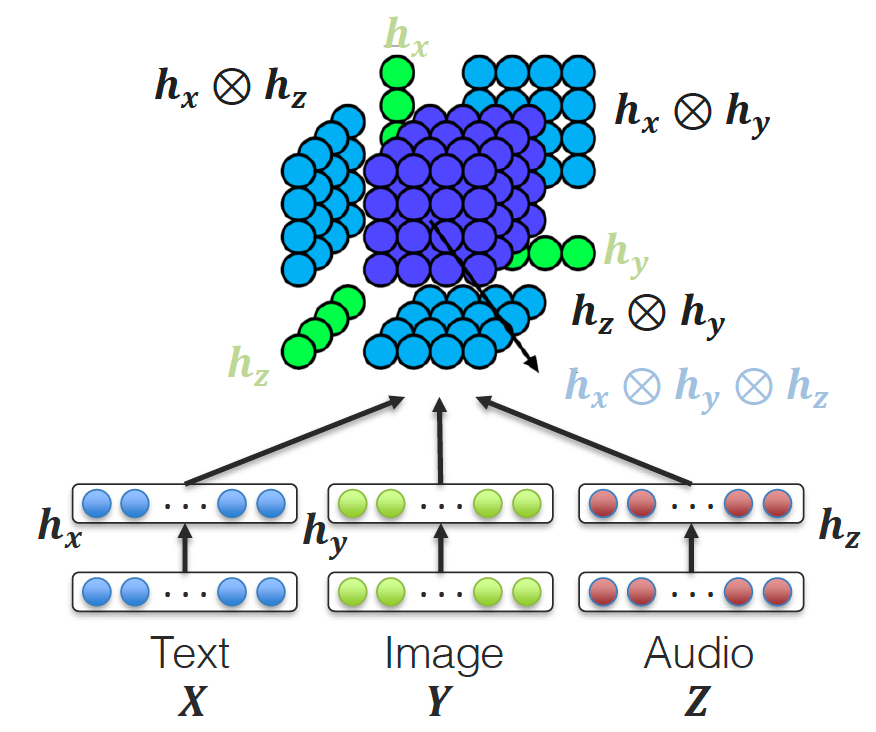

# 双线性池化

双线性池化是双模态交互的重要手段，虽然目前transformer模型成为主流，但是了解双线性池化的思想还是具有非常重要的意义。

### 1、Groud Knowledge

#### 1.1 外积：

外积(outer product)是线性代数中的一类重要运算，对于n维和m维的两个向量，其外积为一个$n \times m$ 的矩阵。给定两个向量 $\mathbf{u}=\left(u_{1}, u_{2}, \ldots u_{m}\right), \mathbf{v}=\left(v_{1}, v_{2}, \ldots v_{n}\right)$ ，则：
$$
\mathbf{u} \otimes \mathbf{v}=\mathbf{A}=\left[\begin{array}{cccc}
u_{1} v_{1} & u_{1} v_{2} & \ldots & u_{1} v_{n} \\
u_{2} v_{1} & u_{2} v_{2} & \ldots & u_{2} v_{n} \\
\vdots & \vdots & \ddots & \vdots \\
u_{m} v_{1} & u_{m} v_{2} & \ldots & u_{m} v_{n}
\end{array}\right]
$$
或者用索引方式表示为：
$$
(\mathbf{u} \otimes \mathbf{v})_{i j}=\mathbf{u}_{i} \mathbf{v}_{j}
$$

### 2、双线性池化介绍

双线性池化首先在[Tenenbaum, 2000 et.al.](http://people.csail.mit.edu/billf/publications/Separating_Style_and_Content.pdf)中被提出：
$$
\boldsymbol{h}_{\boldsymbol{m}}=\boldsymbol{h}_\boldsymbol{x} \otimes \boldsymbol{h}_{\boldsymbol{y}}
$$
其中，$\boldsymbol{h}_\boldsymbol{x}$ 、$\boldsymbol{h}_{\boldsymbol{y}}$ 表示两个模态的特征向量，$\otimes$ 表示外积。即 $\boldsymbol{h}_{x}$ 中的每一个元素都与 $\boldsymbol{h}_{\boldsymbol{y}}$ 相乘，使得两个模态的向量充分交互，得到的 $(\boldsymbol{h}_{\boldsymbol{m}})^{ij}$ 即为  $(\boldsymbol{h}_\boldsymbol{x})^i$ 元素和  $(\boldsymbol{h}_\boldsymbol{y})^j$ 交互（相乘）的结果。 

因此，$\boldsymbol{h}_{\boldsymbol{m}}$ 已经完成了模态交互的这一操作。在情感分类任务中，之后我们就可以直接将 $\boldsymbol{h}_{\boldsymbol{m}}$ 输入线性层中，过一层Softmax得到分类结果。

[Zadeh, 2017 et.al.](https://arxiv.org/abs/1707.07250) 对上述做法进行了改进，将外积过程改为：
$$
h_{m}=\left[\begin{array}{c}
\boldsymbol{h}_\boldsymbol{x} \\
1
\end{array}\right] \otimes\left[\begin{array}{c}
\boldsymbol{h}_\boldsymbol{y} \\
1
\end{array}\right]=\left[\begin{array}{cc}
\boldsymbol{h}_\boldsymbol{x} \otimes \boldsymbol{h}_\boldsymbol{y} & \boldsymbol{h}_\boldsymbol{x}\\
\boldsymbol{h}_\boldsymbol{y} & 1
\end{array}\right]
$$
如下图所示：

这一改进保留了单模态的信息，使得后期的特征更为丰富。
$$
\boldsymbol{h}_{m}=\left[\begin{array}{c}
\boldsymbol{h}_{x} \\
1
\end{array}\right] \otimes\left[\begin{array}{c}
\boldsymbol{h}_{y} \\
1
\end{array}\right] \otimes\left[\begin{array}{c}
\boldsymbol{h}_{z} \\
1
\end{array}\right]
$$
拓展到三模态的情况，如下图所示：

这样的话，就可以同时提取单模态、双模态和三模态显式交互得到的特征。

不过，很容易发现，上述的双线性卷积得到的特征矩阵与单模态特征维度 $L$ 有关，计算复杂度为：
$$
H = L^m
$$
其中， $m$ 为模态个数。

因此，[Liu, 2018 et.al.](https://arxiv.org/abs/1806.00064) 提出了一些降维的方案，有兴趣的同学可以进一步阅读。

> 上述提到的两篇都是CMU 111-77主讲老师Louis-Philippe Morency指导的工作。

### 3、其他论文

[双线性池化（Bilinear Pooling）详解、改进及应用](https://zhuanlan.zhihu.com/p/62532887)