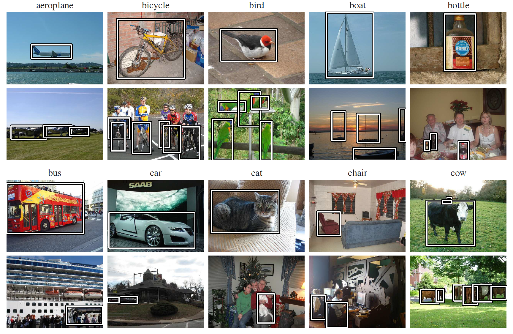
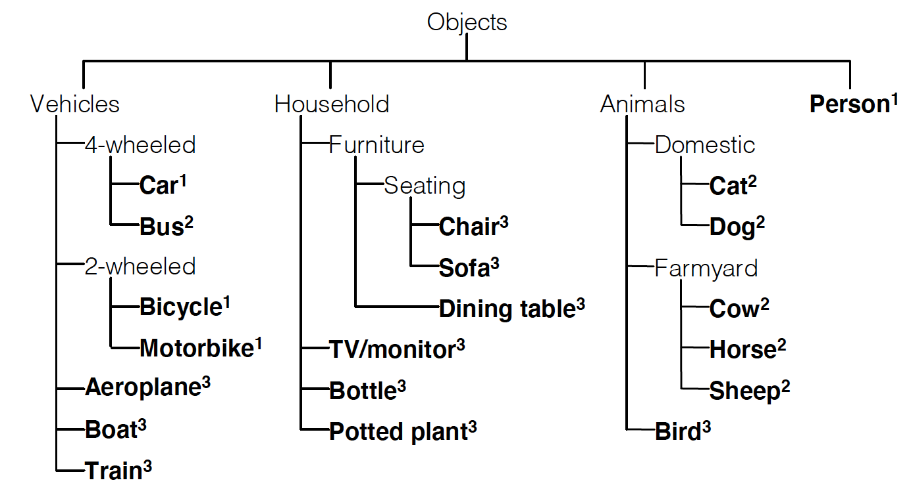
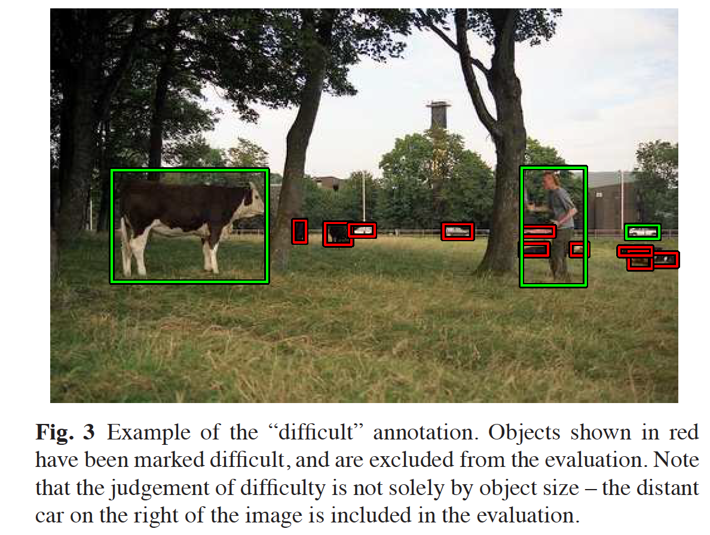
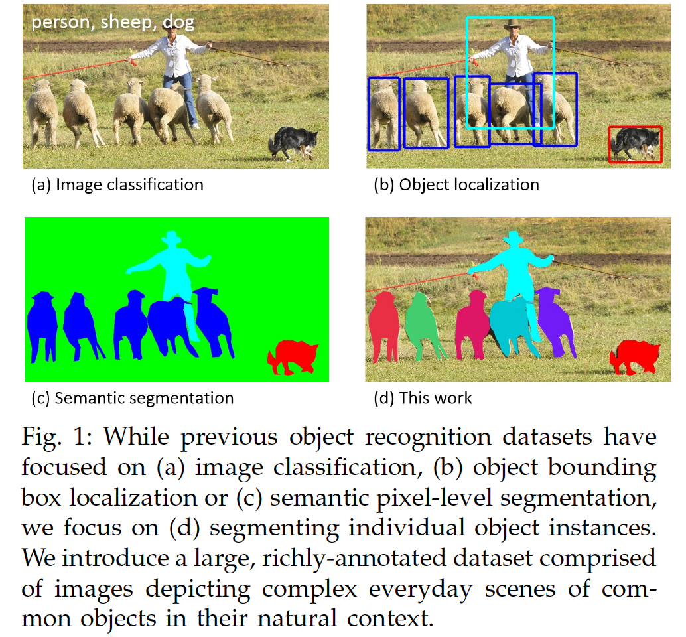
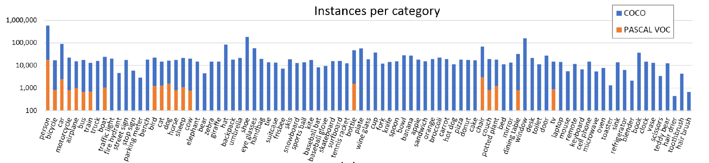
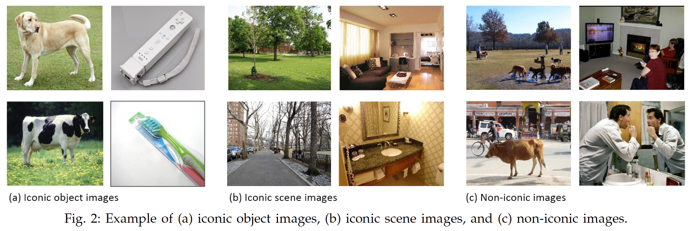
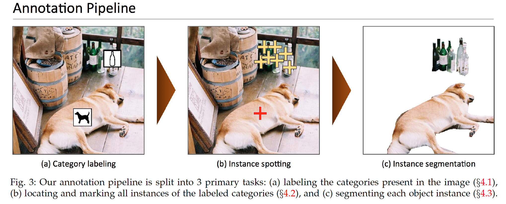

# 目标检测数据集调研

## PASCAL VOC

PASCAL VOC挑战赛 （The PASCAL Visual Object Classes ）是一个世界级的计算机视觉挑战赛，PASCAL全称：Pattern Analysis, Statical Modeling and Computational Learning，是一个由欧盟资助的网络组织。

很多优秀的计算机视觉模型比如分类，定位，检测，分割，动作识别等模型都是基于PASCAL VOC挑战赛及其数据集上推出的，尤其是一些目标检测模型（比如大名鼎鼎的R-CNN系列，以及后面的YOLO，SSD等）。

PASCAL VOC自2005年起每年举办一次比赛。数据集最开始只有4类，到2007年扩充为20个类，共有两个常用的版本：2007和2012。学术界常用train/val 2007和train/val 2012作为训练集，test 2007作为测试集，用train/val 2007+test 2007和train/val 2012作为训练集，test 2012作为测试集，分别汇报结果。

- [PASCAL主页](http://host.robots.ox.ac.uk/pascal/VOC/) 与 [排行榜](http://host.robots.ox.ac.uk:8080/leaderboard/main_bootstrap.php)。
- [PASCAL VOC 2007 挑战赛主页](http://host.robots.ox.ac.uk/pascal/VOC/voc2007/) 与 [PASCAL VOC 2012 挑战赛主页](http://host.robots.ox.ac.uk/pascal/VOC/voc2012/)。

### 1、数据集整体概况

#### 1.1 层级结构

PASCAL VOC 数据集的20个类别及其层级结构：

- 从2007年开始，PASCAL VOC每年的数据集都是这个层级结构
- 总共四个大类：vehicle,household,animal,person
- 总共20个小类，预测的时候是只输出图中黑色粗体的类别
- **数据集主要关注分类和检测，也就是分类和检测用到的数据集相对规模较大。**关于其他任务比如分割，动作识别等，其数据集一般是分类和检测数据集的子集。

#### 1.2 发展历程

下面是几个关键时间点数据集的一些关键变化，详细请查看[PASCAL VOC主页](http://host.robots.ox.ac.uk/pascal/VOC/) ：

- 2005年：还只有4个类别： bicycles, cars, motorbikes, people. Train/validation/test 共有图片1578张，包含2209个已标注的目标objects.
- **2007年** ：在这一年PASCAL VOC初步建立成一个完善的数据集。类别扩充到20类，Train/validation/test共有9963张图片，包含24640个已标注的目标objects。07年之前的数据集中test部分都是公布的，但是之后的都没有公布。
- **2012年**：最后一次挑战赛，最终用于分类和检测的数据集规模为：train/val包含11540张图片，包含27450个已被标注的 ROI annotated objects 。

#### 1.3 使用方法

**目前广大研究者们普遍使用的是 VOC2007和VOC2012数据集，因为二者是互斥的，不相容的。**

**论文中针对 VOC2007和VOC2012 的具体用法有以下几种：**

- 只用VOC2007的trainval 训练，使用VOC2007的test测试
- 只用VOC2012的trainval 训练，使用VOC2012的test测试，这种用法很少使用，因为大家都会结合VOC2007使用
- **使用 VOC2007 的 train+val 和 VOC2012的 train+val 训练，然后使用 VOC2007的test测试，这个用法是论文中经常看到的 07+12 ，研究者可以自己测试在VOC2007上的结果，因为VOC2007的test是公开的。**
- **使用 VOC2007 的 train+val+test 和 VOC2012的 train+val训练，然后使用 VOC2012的test测试，这个用法是论文中经常看到的 07++12 ，这种方法需提交到VOC官方服务器上评估结果，因为VOC2012 test没有公布。**
- 先在 MS COCO 的 trainval 上预训练，再使用 VOC2007 的 train+val、 VOC2012的 train+val 微调训练，然后使用 VOC2007的test测试，这个用法是论文中经常看到的 07+12+COCO 。
- 先在 MS COCO 的 trainval 上预训练，再使用 VOC2007 的 train+val+test 、 VOC2012的 train+val 微调训练，然后使用 VOC2012的test测试 ，这个用法是论文中经常看到的 07++12+COCO，这种方法需提交到VOC官方服务器上评估结果，因为VOC2012 test没有公布。

### 2、数据集构建

#### 2.1 图像获取

从filckr中抽取了500,000张图片。具体的抽取过程：对于需要标注的20个类别中的某一个类别，用与该类别对应的query（如下所示）在flickr中搜索。每个query需要搜索100,000张image（一个页面1000张的话，就是100个页面的全部图片）。在这些图片中，随机选择一张，作为当前query的图片加入到数据中。然后，选择另一个新的query。

以上过程循环往复，直到下载足够多的图像。使用 flickr API 的python接口完成上述过程，在一台机器上运行数小时即可。

> 类别可选的query（三个类别）：
>
> – **sheep**, ram, fold, fleece, shear, baa, bleat, lamb, ewe, wool, flock
>
> – **sofa**, chesterfield, settee, divan, couch, bolster
>
> – **table**, dining, cafe, restaurant, kitchen, banquet, party, meal

#### 2.2 图像标注

对于上述20个类别中的对象，图像的标注属性如下所示：

- class：名称，20个类别

- viewpoint：拍摄角度：front, rear, left, right, unspecified

- truncation：目标是否被截断（比如在图片之外），或者被遮挡（超过15%）

- difficult：检测难易程度，这个主要是根据目标的大小，光照变化，图片质量来判断

  difficult 标签示例：图中红色框，被标记为 difficult。

  

- bounding box：bounding box 的左上角点和右下角点的4个坐标值。

## MS COCO

[MS COCO](http://cocodataset.org/) (Microsoft COCO: Common Objects in Context) 数据集是微软构建的一个数据集，主要是为了解决detecting non-iconic views of objects（detection）, contextual reasoning between objects and the precise 2D localization of objects（segmentation） 这三种场景下的问题。

与PASCAL数据集相比，MSCOCO中的图片包含了自然图片以及生活中常见的目标图片，背景比较复杂，目标数量比较多，目标尺寸更小，更加偏好目标与其场景共同出现的图片，即non-iconic images，因此COCO数据集上的任务更难，对于检测任务来说，现在衡量一个模型好坏的标准更加倾向于使用COCO数据集上的检测结果。

### 1、统计信息

MSCOCO总共包含91个类别，每个类别的图片数量如下：

- 图中也标出了PASCAL VOC的统计数据作为对比。

MSCOCO在2014年发布的数据包含82,783 training, 40,504 validation, and 40,775 testing images (approximately 1/2 train, 1/4 val, and /4 test)。其中，在2014 train+val data中，有270k个segmented people和886k个segmented object instances。

学术界较为通用的划分是使用train和35k的val子集作为训练集（trainval35k），使用剩余的val作为测试集（minival），同时向官方的evaluation server提交结果（test-dev）。除此之外，COCO官方也保留一部分test数据作为比赛的评测集。

### 2、初步数据收集

如何选择目标的类别以及如何收集图片。

#### 2.1 目标类别的选择

- 对类别的要求：

  1. 所有类别中有代表性的那些类别
  2. 和现实应用相关
  3. 高频出现以保证数据集数据多

- stuff & thing

  - thing：很容易区分和标注，比如person、chair。

  - stuff：没有明显边界，比如sky、street、grass。

    由于MSCOCO关注对象的精确位置信息，因此数据集中只标注了thing类别，没有标注stuff类别。

- 类别细分度（Fine-grained）

  - 例：牧羊犬是狗，狗也是哺乳动物，那么类别应该是“牧羊犬”、“狗”还是“哺乳动物”？
  - 为了方案的可行性，需要保证每个类别有大量实例，该数据集的类别选择entry-level（入门级别），即人们普遍使用的类别：如dog、chair、person。

- 对象的某一部分（object-part categories）

  数据集中对某些对象的某些部分也会进行类别标注，比如face、hands、wheels，它们有益于现实中的应用。

- 确定数据集中的类别

  1. PASCAL VOC classes+a subset of the 1200 most frequently used words that denote visually identifiable objects
  2. 让4到8岁的小孩说出他们在室内外看到的物体
  3. 数据集的co-authors按照1到5个等级进行投票，考虑是否常用、现实应用价值、与其它类别的差异程度等。
  4. 根据投票结果选择类别，同时需要保证每个类别实例数量均匀且充足。（PASCAL VOC的所有类别都被包含在MSCOCO中）。
  5. 最终得到91个类别。

#### 2.2 非标志性的(non-iconic)图片收集

得到这些类别后，下一步就是按照这些类别去收集候选图像。

- 将图片分为3类

  1. iconic object images，标志性图像，类别中的object往往是图像中心部分的一个单独的主体，十分明显。这些图像可以通过谷歌和必应图片搜索可以很方便地找到。
  2. iconic scene images，生活中常见的经典场景，画面中往往没有行人。
  3. non-iconic images，场景和对象混在一起，这些图片与现实生活场景更相近。MSCOCO数据集的主要目标是收集这些图片。

- 收集**non-iconic images**，采用两个策略

  1. 像VOC一样，从Flickr中收集。因为flickr的图像（摄影作品）往往更为复杂化，含有的iconic image较少。

  2. 成对搜索类别，比如dog + car，搜索结果一般都是non-iconic images，甚至图片里不只这两个类别。

     如果找不到足够的图片，就单独搜索类别，然后用一个显式的过滤策略筛选出non-iconic images。

### 3、数据标注

众包的标注人员来自Amazon's Mechanical Turk (AMT)，图像标注的流程如下：

#### 3.1 图片标注

如何标注收集到的图片

- 标注pipeline，见Fig3
  1. 类别标注
  2. 实例定位
  3. 实例分割
- 提高标注质量
  1. 类别标注和实例定位这两个阶段的标注人员增加到8个。
  2. 增加一个额外的阶段来检查和确认实例分割的标注结果。

#### 3.2 类别标注(Category Labeling)

- 类别标注做什么

  确定图片里有哪些类别，Fig3(a)，大致标出位置

- 类别标注怎么做

  - 采用分级/分步：考虑到让标注人员从91个类别中直接分类过于耗时，因此采用一个分级的标注策略。先将91个类别分为11个父类（比如cat,dog都属于animal父类）。
    1. 给定图像，向标注人员依次显示每组类别，并要求其指示是否存在该父类的实例。
    2. 如果某标注人员负责从父类（比如动物）中确定存在实例，则对于存在的每个下属类别（狗，猫等），工作人员必须将类别的图标拖到该类别的一个实例上的图像上。（只需标出图片里有哪些类别，比如有多个dog，标出一个即可。）
  - 共8个标注人员负责这项工作，如果有任何标注人员指出该类别，则认为该类别存在（提高recall）；误报将在后续阶段处理。

- 类别标注耗时多久

  这个阶段耗时20k工时

#### 3.3 实例定位

- 实例定位做什么

  基于上一步类别标注的结果，标注图像中对象类别的所有实例，大致位置，如果有多个dog，都要标注出来，Fig3(b)。

- 实例定位怎么做

  - 标注人员在上一个阶段中找到的特定类别的每个实例的顶部放置一个叉号。
  - 标注人员可以用放大镜去找到小的实例。
  - 每个工作人员被要求为每个图像标记最多10个给定类别的实例。

- 实例定位耗时多久

  每个图像由8名工人标记，总计约10k个工时

#### 3.4 实例分割

- 实例分割做什么

  基于上一步实例定位的结果，

- 实例分割怎么做

  - 修改了Bell等人开发的用于图像分割的用户接口，并使用这个接口。
  - 要求标注人员使用接口对上一步中标记出来的对象实例进行分割。
  - 如果在图像中已经有一些实例被分割，也显示给当前的工作人员。
  - 标注人员还可以提出图像中没有给定类别的对象实例（这意味着来自上一阶段的误标），或者所有对象实例都已被分割。

- 实例分割的改进

  - 为最小化成本，每个实例仅有一名标注人员分割。但是初步标注出的质量不高。因此，标注人员被加强训练以提高标注结果的质量。同时，增加如下的额外阶段来检查和确认实例分割的标注结果。

- 实例分割额外阶段

  - 要求多个工作人员（3至5名）判断每个标注，判断其是否与实例完全匹配。质量不高的标注将被丢弃，并将相应的实例添加回未标注的对象池中。
  - 一些批准的工人总是生成差劲的标注，这些工人的所有工作都被丢弃。
  - 如果实例很密集，比如人群、一车香蕉，就会标注为一个“crowds”（出于评估目的，标记为crowds的区域将被忽略，并且不会影响探测器的得分。）

- 实例分割耗时多久

  - 22 worker hours per 1,000 segmentations.